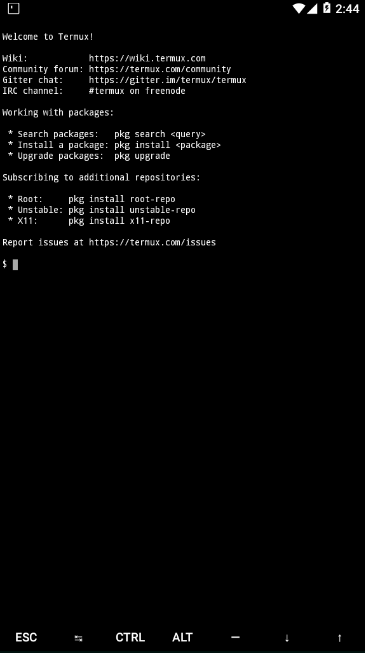

# INSTALACIÓN DE WORDPRESS EN ANDROID DE MANERA SENCILLA 

## indice 

* [¿Qué es wordpress?](#¿Qué-es-wordpress?)
* [Elementos necesarios para la instalacion](#Elementos-necesarios-para-la-instalacion)
* [Instalación paso a paso](#Instalación-paso-a-paso)

## ¿Qué es wordpress? 

WordPress es un sistema de gestión de contenidos (CMS) que permite crear y mantener un blog u otro tipo de web, es un sistema ideal para un sitio web que se actualice periódicamente. 

## Elementos necesarios para la instalación

En este caso vamos a instalar el sistema de wordpress en un android.

Como en cualquier instalación de wordpress necesitaremos un servidor para poder montar el sistema y una base de datos con la cual acceder y almacenar los datos de nuestro sistema, para esto vamos a utilizar la aplicacion de termux.

* Un telefono con android (cualquier version)
* Base de datos, en este caso MariaDB

## Instalación paso a paso

Lo primero que tenemos que hacer es descargar la aplicacion de termux a nuestro celular, la pueden conseguir desde este link:

https://play.google.com/store/apps/details?id=com.termux&hl=es_MX

Al iniciar la aplicacion por primera vez tardará un poco pero no se preocupen, es normal.
Una vez iniciado nos aparecerá algo como esto:

Que es simplemente la terminal que se ha iniciado y nos da la bienvenia.

Ahora vamos a actualizar nuestra terminal y vamos a instalar las herramientas que necesitaremos para poder instalar wordpress

lo primero que tenemos que hacer es ejecutal los siguientes comandos:
`pkg update && pkg upgrade`
