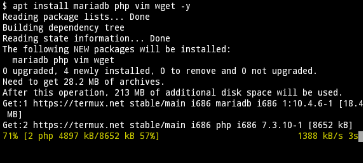
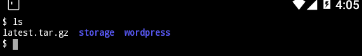
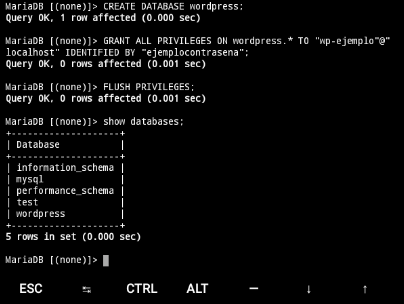

# INSTALACIÓN DE WORDPRESS EN ANDROID DE MANERA SENCILLA 

## indice 

* [¿Qué es wordpress?](#¿Qué-es-wordpress?)
* [Elementos necesarios para la instalacion](#Elementos-necesarios-para-la-instalacion)
* [Instalación paso a paso](#Instalación-paso-a-paso)

## ¿Qué es wordpress? 

WordPress es un sistema de gestión de contenidos (CMS) que permite crear y mantener un blog u otro tipo de web, es un sistema ideal para un sitio web que se actualice periódicamente. 

## Elementos necesarios para la instalación

En este caso vamos a instalar el sistema de wordpress en un android.

Como en cualquier instalación de wordpress necesitaremos un servidor para poder montar el sistema y una base de datos con la cual acceder y almacenar los datos de nuestro sistema, para esto vamos a utilizar la aplicacion de termux.

* Un telefono con android (cualquier version)
* Base de datos, en este caso MariaDB


## Instalación paso a paso

Lo primero que tenemos que hacer es descargar la aplicacion de termux a nuestro celular, la pueden conseguir desde este link:

https://play.google.com/store/apps/details?id=com.termux&hl=es_MX

Al iniciar la aplicacion por primera vez tardará un poco pero no se preocupen, es normal.
Una vez iniciado nos aparecerá algo como esto:


Que es simplemente la terminal que se ha iniciado y nos da la bienvenia.

Ahora vamos a actualizar nuestra terminal y vamos a instalar las herramientas que necesitaremos para poder instalar wordpress

lo primero que tenemos que hacer es ejecutal los siguientes comandos que nos servirán para actualizar nuesta terminal :

`pkg update && pkg upgrade`

una vez actualizada nuestra terminal vamos a instalar las herramientas necesarias:

`apt install mariadb php vim wget -y` 



ahora vamos a ver por partes lo que estamos haciendo:

con apt install le estamos diciendo a nuestra terminal que queremos instalar algunas herramientas las cuales se estan especificando,
tenemos mariadb que es la base de datos que vamos a utilizar, tenemos php que lo utilizaremos para crear el servidor, vim como editor de texto y
por ultimo wget para descargar archivos de internet.

una vez instaladas las herramientas vamos a descargar wordpress

utilizamos el sigiente comando para descargar la ultima version de wordpress: `wget https://wordpress.org/latest.tar.gz`

cuando temine la descarga nos aparecera un archivo llamado: latest.tar.gz lo que significa que el archivo esta compimido y tenemos que descomprimir
para poder ver el contenido, como es un archivo tar usarémos este comando: `tar xvzf latest.tar.gz`

al terminal nos aparecerá la carpeta llamada wordpress



Una cosa muy importante que tenemos que hacer es crear nuestra base de datos "wordpress", para crearla vamos a usar lo siguiente:

vamos a ejecutar el siguiente comando para iniciar el servicio de mariadb: `mysqld`
 
una vez ejecutado nos aparecerá algo como esto:


lo que significa que ya se esta ejecutando el servicio de mariadb. lo que sigue es crear una nueva sesion en nuetro termux, lo cual se hace arrastrando la pantalla hacia la derecha, y nos pararecerá un menú el cual nos permite crear mas sesiones:


En la nueva sesion ejecutamos el comando: `mysql` para entrar al entorno de mariadb y seguir con el procedimiento.


podemos ver las bases de datos que vienen por defecto con el comando: `show databases;`


Ahora utilizaremos los siguentes comandos para crear nuestra base de datos y otorgarle permisos para trabajar.

RECUERDEN CAMBIAR EL USUARIO Y CONTRASEÑA
```
MariaDB> CREATE DATABASE wordpress;
MariaDB> GRANT ALL PRIVILEGES ON wordpress.* TO "wp-user"@"localhost" IDENTIFIED BY "contraseña";
MariaDB> FLUSH PRIVILEGES;
MariaDB> EXIT
```



